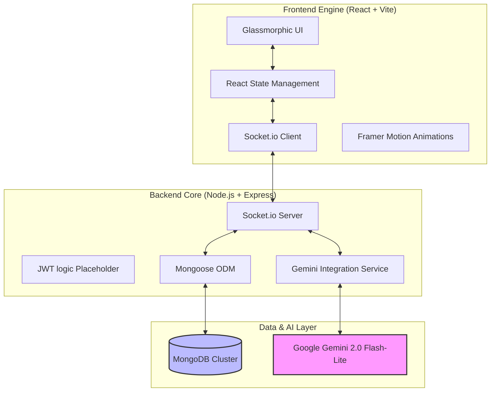

# 🌌 Nexus Chat: AI-Augmented Real-Time Communication

Nexus Chat is a professional-grade, full-stack real-time communication platform built on the **MERN** stack. It integrates **Google Gemini AI** to transform ordinary chat into an intelligent workspace with context-aware suggestions, instant summaries, and a seamless, high-performance UI.


---

## 🏗️ System Architecture

Nexus Chat uses a decoupled architecture to ensure scalability and real-time responsiveness.



---

## ✨ Key Features

### 🧠 AI-Powered Intelligence
- **One-Click Summarization**: Condense long discussions into actionable bullet points. Features a custom parsing engine to handle AI's markdown outputs within a beautiful glassmorphic modal.
- **Real-Time File Sharing**: Support for high-speed image and PDF uploads (up to 10MB) powered by Cloudinary. Features real-time previews for images and dedicated document icons for PDFs.
- **Latency Monitoring**: Built-in QA tools track AI inference time, highlighting performance bottlenecks in real-time.

### ⚡ Professional Real-Time UX
- **Dynamic Typing Indicators**: Synchronized user presence with debounced cleanup logic.
- **Multi-Room Isolation**: Dedicated channels (General, Tech, Design, etc.) with persistent message history.
- **Skeleton Loading**: High-premium pulsing placeholders used during initial room synchronization.
- **Connection Resilience**: Persistent connection monitoring with non-intrusive status banners for offline and reconnected states.

### 🎨 Design System
- **Glassmorphism**: A stunning UI utilizing `backdrop-filter` and curated HSL palettes (Slate & Indigo).
- **Micro-animations**: Fluid transitions powered by Framer Motion for message delivery, modal popping, and sidebar toggling.

---

## 🛠️ Tech Stack

| Layer | Technologies |
| :--- | :--- |
| **Frontend** | React 19, Vite, Framer Motion, Lucide Icons, Socket.io-client |
| **Backend** | Node.js, Express, Socket.io, Mongoose |
| **AI** | Google Generative AI (Gemini 2.0 Flash-Lite) |
| **Storage** | Cloudinary (Free Forever Tier) |
| **Database** | MongoDB |
| **DevOps** | Docker, Docker Compose, Nginx |

---

## 🧠 Challenges Overcome: Managing Race Conditions

Implementing a real-time system with persistent storage and AI integration introduced several complex race conditions. Here is how we solved them:

### 1. The "State Overwrite" Conflict
**Challenge**: When a user joins a room, `room_history` is fetched asynchronously. If a new message (`receive_message`) arrives *during* the fetch, it could be lost or overwritten depending on how the message list is updated.
**Solution**: We implemented an `isLoadingHistory` flag. The UI shows skeleton loaders until history is committed, and the `receive_message` listener uses a functional state update `setMessageList(list => [...list, data])` to ensure incoming messages are appended regardless of when the history fetch completes.

### 2. Typing Indicator Synchronization
**Challenge**: Synchronizing "is typing" states across dozens of users can lead to "phantom typing" if users disconnect or experience lag.
**Solution**: We implemented a hybrid strategy:
- **Server-Side**: Broadcasts `typing` and `stop_typing` events to specific rooms.
- **Client-Side**: A 3000ms debounce timer that automatically emits `stop_typing` if no input is detected, plus a `socket.off` cleanup in `useEffect` to clear state on tab closure.

### 3. AI Inference Latency
**Challenge**: LLM calls can take 1-2 seconds, creating a "frozen" feeling in the UI.
**Solution**: We moved AI generation to a background "pre-fetch" cycle. When a message is received, the AI starts thinking in the background. The UI displays "Shimmer" placeholders for suggestions, popping them into view only when the payload is ready, ensuring the core chat experience remains fluid.

---

## 🚀 Getting Started

### Prerequisites
- Node.js v18+
- MongoDB (Local or Atlas)
- [Google Gemini API Key](https://aistudio.google.com/app/apikey)

### 1. Clone & Install
```bash
git clone https://github.com/yourusername/real-time-chat.git
cd real-time-chat
# Install Backend
cd server && npm install
# Install Frontend
cd ../client && npm install
```

### 2. Environmental Configuration
Create a `.env` file in `/server`:
```env
GEMINI_API_KEY=your_api_key_here
MONGO_URI=mongodb://localhost:27017/chat_app
PORT=5000
AWS_ACCESS_KEY_ID=your_key
AWS_SECRET_ACCESS_KEY=your_secret
AWS_REGION=your_region
AWS_S3_BUCKET_NAME=your_bucket
# Cloudinary (Preferred for Free Forever tier)
CLOUDINARY_CLOUD_NAME=your_cloud_name
CLOUDINARY_API_KEY=your_key
CLOUDINARY_API_SECRET=your_secret
```
Create a `.env` file in `/client`:
```env
VITE_API_URL=http://localhost:5000
```

### 3. Run Development
```bash
# Terminal 1: Backend
cd server && npm run dev
# Terminal 2: Frontend
cd client && npm run dev
```

---

## 🐳 Docker Deployment

The project is fully containerized. Use the provided production-ready `docker-compose` configuration:

```bash
export GEMINI_API_KEY=your_key_here
docker-compose up --build
```
The application will be available at `http://localhost`.

---

## 📁 Repository Structure
```text
.
├── client/          # Vite + React Frontend
├── server/          # Express + Socket.io + Gemini API
├── docker-compose   # Multi-container orchestration
└── DEPLOYMENT.md    # Detailed production deployment guide
```

---
*Built for the next generation of real-time collaboration.*
